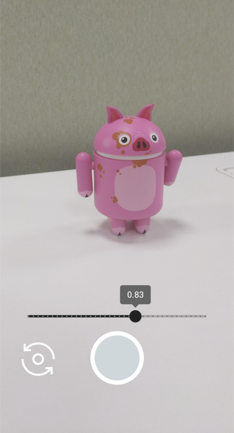

# CameraX EV sample

Exposure compensation (EV) control sample in CameraX.

This is a sample app built on the top of the CameraX, it opens the preview and image capture and adds a seekbar to control the EV API.

## Demo

## Other resources

- [CameraX official](https://developer.android.com/training/camerax)
- [CameraXBasic](https://github.com/android/camera-samples/tree/main/CameraXBasic)
